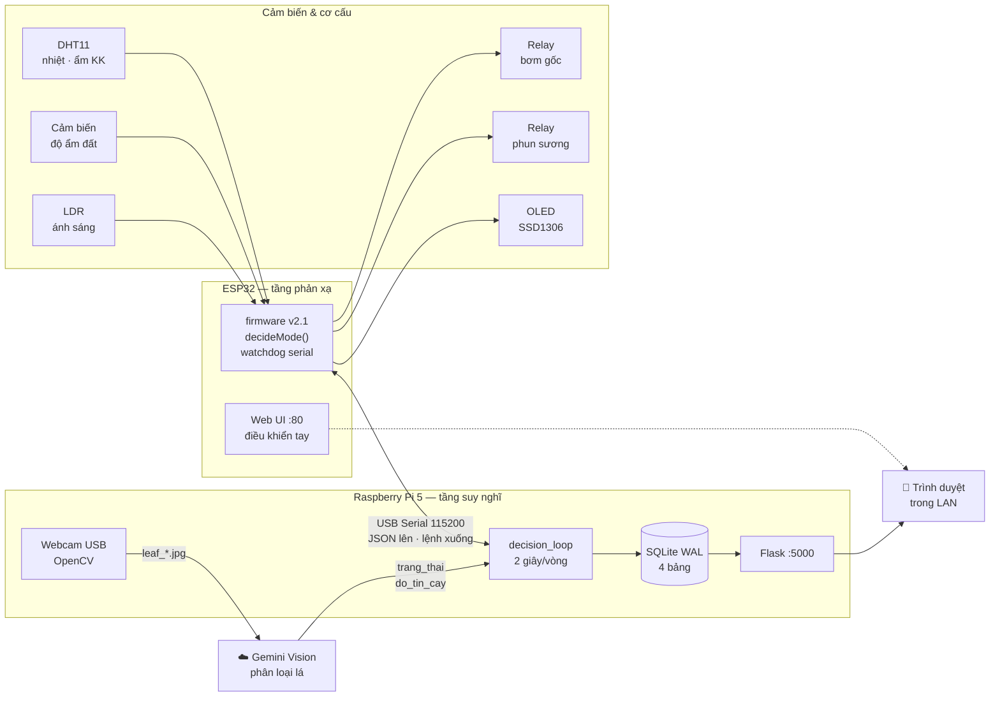
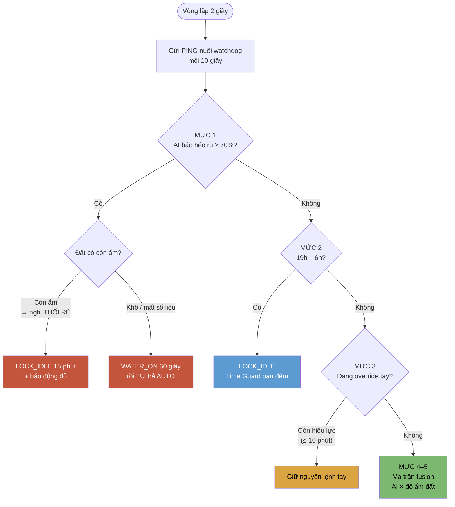

# 🌿 Home Garden — Hệ thống IoT + AI tự động chăm sóc cây

> Vườn rau mini tự vận hành: ESP32 đo cảm biến và điều khiển bơm, Raspberry Pi 5
> chụp ảnh lá gửi cho Gemini Vision chẩn đoán bệnh, rồi **kết hợp kết quả AI với
> độ ẩm đất** để ra quyết định tưới. Toàn bộ có dashboard web trong LAN.

Đồ án SIC IoT Capstone · Trường ĐH Công nghệ Thông tin và Truyền thông (ICTU)

---

## Mục lục

- [1. Hệ thống này là gì?](#1-hệ-thống-này-là-gì)
- [2. Kiến trúc](#2-kiến-trúc)
- [3. Phần cứng](#3-phần-cứng)
- [4. Bộ não: 5 mức ưu tiên quyết định](#4-bộ-não-5-mức-ưu-tiên-quyết-định)
- [5. Ma trận fusion AI × Độ ẩm đất](#5-ma-trận-fusion-ai--độ-ẩm-đất)
- [6. Ba lớp an toàn](#6-ba-lớp-an-toàn)
- [7. Cài đặt](#7-cài-đặt)
- [8. Dashboard web](#8-dashboard-web)
- [9. REST API](#9-rest-api)
- [10. Cơ sở dữ liệu](#10-cơ-sở-dữ-liệu)
- [11. Cấu trúc dự án](#11-cấu-trúc-dự-án)
- [12. Biến môi trường](#12-biến-môi-trường)
- [13. Hạn chế đã biết](#13-hạn-chế-đã-biết)
- [14. Lịch sử phiên bản](#14-lịch-sử-phiên-bản)

---

## 1. Hệ thống này là gì?

Một hệ thống tưới cây tự động **hai tầng**, trong đó AI không chỉ để "cho có" mà
thực sự thay đổi hành vi của bơm nước:

| Tầng | Thiết bị | Vai trò |
|---|---|---|
| **Tầng phản xạ** | ESP32 | Đọc DHT11 / cảm biến đất / LDR mỗi vòng lặp, tự bật bơm theo ngưỡng. Có web UI riêng, OLED, và **watchdog** tự cứu mình. Chạy độc lập kể cả khi Pi tắt. |
| **Tầng suy nghĩ** | Raspberry Pi 5 | Chụp ảnh lá 15 phút/lần → Gemini Vision phân loại bệnh → đối chiếu với độ ẩm đất → gửi lệnh ghi đè xuống ESP32 qua Serial. Lưu SQLite, phục vụ dashboard. |

**Điểm khác biệt so với một hệ tưới hẹn giờ thông thường** — hệ thống phân biệt
được các tình huống mà cảm biến độ ẩm một mình không thể:

- Cây **héo rũ nhưng đất còn ẩm** → đây là thối rễ hoặc sốc nhiệt, tưới thêm sẽ
  giết cây nhanh hơn. Hệ thống **khoá tưới 15 phút** và báo động đỏ.
- Cây **vàng lá nhưng đất còn ẩm** → thiếu đạm, không phải thiếu nước. Hệ thống
  cảnh báo bổ sung dinh dưỡng và **không tưới thêm**.
- Lá có **đốm nâu** (nấm) → nấm gặp độ ẩm cao sẽ lan. Hệ thống **cấm phun sương**
  nhưng vẫn cho tưới gốc theo ngưỡng.
- **Camera bị chĩa sai chỗ** → sau 3 lần liên tiếp không nhận ra cây, hệ thống
  hiện băng cảnh báo đỏ thay vì im lặng báo "cây bình thường".

---

## 2. Kiến trúc



### Giao thức Serial

**ESP32 → Pi** (mỗi 2 giây, JSON một dòng):

```json
{"temp":28.4,"humi":72,"soil":35,"light":48,"water":true,"mist":false,
 "mist_locked":false,"wd_tripped":false,"mode":"AUTO","reason":"Kho + binh thuong - tuoi goc"}
```

**Pi → ESP32** (lệnh dạng text, một dòng):

| Lệnh | Tác dụng |
|---|---|
| `WATER_ON` / `WATER_OFF` | Bật/tắt bơm gốc, chuyển ESP32 sang MANUAL |
| `MIST_ON` / `MIST_OFF` | Bật/tắt phun sương, chuyển sang MANUAL |
| `AUTO` | Trả ESP32 về tự quyết theo cảm biến |
| `LOCK_IDLE` | Khoá cứng: tắt hết, không cho AUTO can thiệp |
| `MIST_LOCK` / `MIST_UNLOCK` | Khoá **riêng** phun sương, **vẫn giữ AUTO** cho tưới gốc |
| `PING` | Nhịp tim 10 giây/lần — nuôi watchdog, không đổi trạng thái |

---

## 3. Phần cứng

| Thành phần | Model | Chân ESP32 |
|---|---|---|
| Vi điều khiển | ESP32 DevKit V1 | — |
| Nhiệt độ / ẩm không khí | DHT11 | GPIO 4 |
| Ánh sáng | LDR + trở 10kΩ | GPIO 34 (ADC) |
| Độ ẩm đất | Cảm biến điện dung | GPIO 35 (ADC) |
| Relay bơm gốc | Module relay 5V (active LOW) | GPIO 26 |
| Relay phun sương | Module relay 5V (active LOW) | GPIO 27 |
| Màn hình | OLED SSD1306 128×64 I²C | SDA 21 · SCL 22 |
| Nút xoá WiFi | Nút BOOT sẵn có | GPIO 0 |
| Máy tính trung tâm | Raspberry Pi 5 (4/8GB) | — |
| Camera | Webcam USB 720p+ | `/dev/video0` |

**Ngưỡng trong firmware** ([`firmware/v2/v2.ino`](firmware/v2/v2.ino)):

```c
#define SOIL_DRY_PCT_THRESHOLD 40      // < 40% coi là đất khô
#define HOT_TEMP_THRESHOLD     33.0    // ≥ 33°C thì phun sương thay vì tưới gốc
#define DARK_LIGHT_THRESHOLD   20      // < 20% coi là tối, không tưới (tránh úng)
#define SERIAL_WATCHDOG_MS     60000   // 60s im lặng = Pi đã chết
```

> ⚠️ `SOIL_DRY_PCT_THRESHOLD` trong firmware **phải khớp** với
> `SOIL_DRY_THRESHOLD` trong `main.py`. Lệch nhau thì Pi và ESP32 sẽ đánh giá
> "đất khô" khác nhau và tranh nhau điều khiển bơm.

### Cấu hình WiFi cho ESP32

Firmware dùng **WiFiManager** — không hard-code SSID/mật khẩu vào code:

1. Nạp firmware, cấp nguồn ESP32.
2. Điện thoại kết nối WiFi `SmartGarden-Setup`, mật khẩu `12345678`.
3. Portal tự mở → chọn WiFi nhà và nhập mật khẩu.
4. Muốn xoá cấu hình cũ: **giữ nút BOOT khi cấp nguồn**.

---

## 4. Bộ não: 5 mức ưu tiên quyết định

`decision_loop()` đánh giá lại toàn bộ **mỗi 2 giây**. Không mức nào (trừ mức 3)
có thể bị mức thấp hơn âm thầm ghi đè.



**Vì sao thứ tự này quan trọng:**

- **Mức 1 đứng trước mức 3** → người dùng bấm `WATER_ON` trên web không thể vô
  hiệu hoá lệnh khoá khi hệ thống nghi thối rễ.
- **Mức 2 đứng trước mức 3** → an toàn ban đêm không thể bị lệnh tay ghi đè.
  Tưới đêm khi trời tối và đất khô là công thức gây úng rễ và nấm.
- **Mức 4 chỉ chạy khi AI đáng tin** (`trusted = True`). AI không chắc chắn thì
  hệ thống **rơi về chạy thuần cảm biến**, chứ không đoán bừa.

---

## 5. Ma trận fusion AI × Độ ẩm đất

Đây là phần AI **thực sự thay đổi hành vi cơ cấu chấp hành**, không chỉ in cảnh báo:

| AI chẩn đoán | Đất khô (< 40%) | Đất đủ ẩm (≥ 40%) |
|---|---|---|
| 🔴 **Héo rũ** ≥ 70% *(khẩn cấp)* | `WATER_ON` xung 60s → tự trả `AUTO` | 🚨 `LOCK_IDLE` 15 phút — **nghi thối rễ** |
| 🔴 Héo rũ < 70% | `AUTO` — để ESP32 tưới theo ngưỡng | `AUTO` + cảnh báo kiểm tra rễ bằng mắt |
| 🟠 **Đốm nâu** (nấm) | `MIST_LOCK` + `AUTO` — cấm sương, vẫn tưới gốc | `MIST_LOCK` + `AUTO` — cấm sương, theo dõi nấm |
| 🟡 **Vàng lá** | `AUTO` — có thể do thiếu nước | ⚠️ `AUTO` + cảnh báo **THIẾU ĐẠM**, không tưới thêm |
| 🟢 **Bình thường** | `MIST_UNLOCK` + `AUTO` | `MIST_UNLOCK` + `AUTO` |
| ⚪ **Không xác định** | `AUTO` — **bỏ qua AI hoàn toàn** | `AUTO` — **bỏ qua AI hoàn toàn** |

### Cách AI được kiểm chứng trước khi tin

`normalize_ai_result()` chặn hai dạng kết quả rác mà Gemini thực tế đã trả về:

```python
trusted = raw_state in VALID_AI_STATES and conf >= AI_MIN_CONF   # AI_MIN_CONF = 40
state   = raw_state if trusted else "khong_xac_dinh"
```

1. **Trạng thái ngoài enum** → hạ xuống `khong_xac_dinh`.
2. **`binh_thuong` với `do_tin_cay = 0`** (camera chĩa nhầm chỗ) → cũng bị hạ xuống.

Kết quả `khong_xac_dinh` **không có quyền** tác động cơ cấu chấp hành.

Prompt gửi Gemini có **bước 0 bắt buộc**: kiểm tra ảnh có thực sự chứa lá cây
hay không, nếu không thì phải trả `khong_xac_dinh` với `do_tin_cay = 0`.

---

## 6. Ba lớp an toàn

Hệ thống này điều khiển bơm nước thật. Ba cơ chế độc lập bảo đảm bơm không bao
giờ chạy vô thời hạn:

### 6.1 `pulse()` — mọi lệnh ép actuator đều có thời hạn

```python
def pulse(name, duration, cooldown):
    """Trả True nếu hành động ĐANG hiệu lực, False nếu đã hết / đang cooldown."""
```

Tưới khẩn cấp chỉ được 60 giây rồi **tự trả về `AUTO`**, sau đó vào cooldown 1
giờ. Khoá thối rễ 15 phút rồi cooldown 30 phút. Không có đường nào ép bơm chạy
mãi.

### 6.2 Watchdog serial trên ESP32 — Pi chết thì ESP32 tự cứu

Nếu Pi mất điện / crash / bị `systemctl stop` **ngay sau khi gửi `WATER_ON`**,
ESP32 sẽ kẹt trong `manualMode` với bơm đang chạy và không còn ai gửi lệnh tắt.

Firmware v2.1 giải quyết: Pi gửi `PING` mỗi 10 giây. Quá 60 giây không nhận được
gì **và** chế độ thủ công đó do Pi đặt ra → ESP32 tự quay về `AUTO`, gửi lên
`{"event":"watchdog",...}`, và dashboard hiện băng cảnh báo.

Chế độ thủ công người dùng bấm trên **web UI của chính ESP32** thì watchdog
không đụng tới (`g_manualFromSerial = false`).

### 6.3 Time Guard — không tưới đêm

19h–6h luôn là `LOCK_IDLE`, đặt **trên** mức override thủ công. Firmware còn có
lớp thứ hai độc lập: `isDark && isDry → MODE_IDLE`.

---

## 7. Cài đặt

### 7.1 Nạp firmware ESP32

Arduino IDE → cài board **ESP32** và các thư viện:
`WiFiManager`, `Adafruit GFX`, `Adafruit SSD1306`, `DHT sensor library`.

Mở [`firmware/v2/v2.ino`](firmware/v2/v2.ino) → chọn board *ESP32 Dev Module* → Upload.

> Nếu Pi đang chạy service, phải dừng trước khi nạp:
> `sudo systemctl stop smart-garden` (nếu không sẽ báo *port busy*).

Chi tiết và khác biệt v1 → v2.1: [`firmware/README.md`](firmware/README.md).

### 7.2 Cài trên Raspberry Pi 5

Yêu cầu: **Raspberry Pi OS Bookworm 64-bit** (`uname -m` phải ra `aarch64`),
nguồn 27W USB-C, thẻ nhớ ≥ 32GB class A2.

```bash
git clone https://github.com/dtc245010034-rgb/Home-Garden-An-IoT-AI-System-for-Automated-Plant-Care-last.git ~/smart_garden
cd ~/smart_garden
bash deploy/install.sh
```

Script làm 8 bước: cài gói hệ thống → cấp quyền `dialout`/`video` → tạo tên cổng
cố định `/dev/esp32` bằng udev → tạo virtualenv → cài thư viện → **hỏi
`GEMINI_API_KEY`** → cài systemd service → khởi động.

Sau khi xong: `sudo reboot` một lần để quyền nhóm `dialout` có hiệu lực.

Lấy API key miễn phí tại <https://aistudio.google.com/apikey>.

### 7.3 Chạy tay để gỡ lỗi

Service systemd không nhận input bàn phím. Muốn gõ `CHECK_LEAF`, `WATER_ON`…:

```bash
sudo systemctl stop smart-garden
cd ~/smart_garden
set -a && source /etc/smart-garden.env && set +a
./venv/bin/python main.py
```

### 7.4 Đặt camera cho đúng — bước quyết định

| Yếu tố | Khuyến nghị |
|---|---|
| Khoảng cách | 25–40 cm từ ống kính tới tán lá |
| Góc | Chếch **45°** từ trên xuống (chụp thẳng đứng sẽ có bóng thân camera đổ lên lá) |
| Khung hình | Lá chiếm **≥ 60%** diện tích. Không để bàn, tường, mặt người lọt vào |
| Ánh sáng | Tránh ngược sáng cửa sổ. Ban đêm cần đèn LED trắng ~5000K |
| Nền | Tấm bìa trắng hoặc đen phía sau khay rau — nền sạch tăng độ tin cậy rõ rệt |
| Cố định | Dùng giá đỡ. Camera xê dịch = dữ liệu chuỗi thời gian mất giá trị |

Kiểm tra: mở dashboard → bấm **"📷 Chụp & chẩn đoán ngay"** → xem nhãn dưới vòng
tròn sức khoẻ phải là **✓ ĐỦ TIN CẬY ĐỂ RA QUYẾT ĐỊNH**.

Chi tiết đầy đủ (udev rules, dò camera index, xử lý sự cố): [`SETUP_PI5.md`](SETUP_PI5.md)

---

## 8. Dashboard web

`http://<IP_CUA_PI>:5000` — mở được từ mọi máy trong cùng LAN, thiết kế
mobile-first, tự làm mới mỗi 3 giây.

| Khu vực | Nội dung |
|---|---|
| **Vòng tròn sức khoẻ** | Trạng thái AI + nhãn đủ/không đủ tin cậy + nút `CHECK_LEAF` |
| **4 thẻ cảm biến** | Nhiệt độ · ẩm không khí · độ ẩm đất (kèm nhãn KHÔ/đủ ẩm) · ánh sáng |
| **Biểu đồ diễn biến** | 4 sparkline, chọn 1 giờ / 6 giờ / 24 giờ / 7 ngày. ≤ 60 phút lấy từ RAM (15s/điểm), dài hơn thì truy vấn SQLite và lấy mẫu thưa ≤ 300 điểm |
| **Kho ảnh lá** | Ảnh mới nhất + dải thumbnail 20 ảnh, mỗi ảnh gắn nhãn độ tin cậy và ghi chú AI |
| **Thiết bị & quyết định** | Trạng thái bơm/sương/chế độ, **mức quyết định** đang áp dụng, lý do của cả ESP32 và Pi |
| **Ma trận fusion** | Bảng 5×2, tự tô sáng ô đang khớp với chẩn đoán hiện tại |
| **Điều khiển thủ công** | 6 nút, override 10 phút rồi tự trả `AUTO` kèm đồng hồ đếm ngược |
| **Nhật ký hệ thống** | 25 sự kiện gần nhất + nút tải CSV 24h |

**Bốn băng cảnh báo** hiện tự động khi cần: cảnh báo camera · tưới khẩn cấp /
nghi thối rễ · ESP32 watchdog đã trip · phun sương đang bị khoá.

---

## 9. REST API

| Endpoint | Method | Mô tả |
|---|---|---|
| `/` | GET | Trang dashboard |
| `/api/status` | GET | Toàn bộ trạng thái: cảm biến, AI, mức quyết định, đồng hồ đếm ngược |
| `/api/history?minutes=60` | GET | Lịch sử cảm biến. `minutes` 5–10080 (7 ngày) |
| `/api/image` | GET | Ảnh lá mới nhất (JPEG, `no-store`) |
| `/api/photos` | GET | Danh sách 50 ảnh gần nhất kèm metadata chẩn đoán |
| `/api/photo/<name>` | GET | Một ảnh cụ thể. Tên phải khớp `leaf_\d{8}_\d{6}\.jpg` |
| `/api/events?limit=60` | GET | Nhật ký sự kiện, `limit` 1–500 |
| `/api/diagnosis?limit=30` | GET | Lịch sử chẩn đoán AI |
| `/api/stats` | GET | Số liệu tổng hợp cho mục *Testing* của báo cáo |
| `/api/export.csv?hours=24` | GET | Xuất CSV, `hours` 1–720 |
| `/api/command` | POST | `{"cmd":"WATER_ON"}` — kích hoạt override thủ công 10 phút |
| `/api/check_leaf` | POST | Chụp + chẩn đoán ngay. Cooldown 60 giây, trả **429** nếu còn cooldown |

Ví dụ:

```bash
curl -s http://192.168.1.50:5000/api/status | jq '.sensor, .ai.trang_thai, .decision_level'
curl -X POST -H 'Content-Type: application/json' \
     -d '{"cmd":"WATER_ON"}' http://192.168.1.50:5000/api/command
curl -X POST http://192.168.1.50:5000/api/check_leaf
```

---

## 10. Cơ sở dữ liệu

SQLite chế độ **WAL** (`smart_garden.db`) — dashboard đọc song song với vòng lặp
ghi, dữ liệu **không mất khi restart**. Khi khởi động, `db_restore_history()` nạp
lại 60 phút cảm biến gần nhất vào RAM để biểu đồ không trống trơn.

| Bảng | Tần suất ghi | Cột |
|---|---|---|
| `sensor_readings` | 60 giây/bản ghi | `ts, epoch, temp, humi, soil, light, water, mist, mode` |
| `ai_diagnosis` | Mỗi lần chẩn đoán | `ts, epoch, source, trang_thai, raw_state, do_tin_cay, trusted, ghi_chu, photo, soil` |
| `commands` | Mỗi lệnh gửi xuống ESP32 | `ts, epoch, cmd, level, reason` |
| `events` | Mỗi sự kiện đáng chú ý | `ts, epoch, event, detail` (JSON) |

Kho ảnh `photos/leaf_YYYYmmdd_HHMMSS.jpg` tự giữ 50 file mới nhất.
`smart_garden_events.log` giữ định dạng JSON-lines để tương thích ngược.

Truy vấn mẫu cho báo cáo:

```sql
-- Tỷ lệ chẩn đoán AI đạt ngưỡng tin cậy
SELECT COUNT(*) AS tong, SUM(trusted) AS dang_tin,
       ROUND(100.0*SUM(trusted)/COUNT(*),1) AS ty_le
FROM ai_diagnosis;

-- Kiểm chứng ma trận fusion: lệnh nào gửi ở mức ưu tiên nào
SELECT level, cmd, COUNT(*) AS so_lan FROM commands GROUP BY level, cmd ORDER BY so_lan DESC;

-- Nhật ký các lần tưới khẩn cấp (bằng chứng kiểm thử)
SELECT ts, detail FROM events WHERE event='emergency_watering' ORDER BY epoch DESC;
```

Thêm truy vấn trong [`SETUP_PI5.md` mục 7](SETUP_PI5.md).

---

## 11. Cấu trúc dự án

```
.
├── main.py                            # Chương trình chính trên Pi (~1100 dòng)
├── templates/
│   └── dashboard.html                 # Dashboard SPA, không phụ thuộc framework
├── firmware/
│   ├── README.md                      # Hướng dẫn nạp + khác biệt v1 → v2.1
│   ├── v1/v1.ino                      # Bản gốc — giữ để đối chiếu, KHÔNG nạp
│   └── v2/v2.ino                      # v2.1 — MIST_LOCK + watchdog serial
├── deploy/
│   ├── install.sh                     # Cài tự động 8 bước
│   └── smart-garden.service           # Unit systemd, Restart=always
├── requirements.txt
├── SETUP_PI5.md                       # Hướng dẫn triển khai + xử lý sự cố
└── README.md
```

### Các luồng (thread) trong `main.py`

| Thread | Chu kỳ | Việc |
|---|---|---|
| `serial_reader` | Liên tục | Đọc JSON từ ESP32, cập nhật state, ghi SQLite mỗi 60s, in ra terminal |
| `ai_vision_worker` | 15 phút | Chụp ảnh → Gemini → chuẩn hoá → ghi DB → cập nhật sức khoẻ camera |
| `dashboard_worker` | — | Flask server |
| `input_listener` | — | Nhận lệnh bàn phím (chỉ khi `stdin.isatty()`) |
| `decision_loop` | **2 giây** | Thread chính: PING + đánh giá 5 mức ưu tiên |

> Mỗi phiên bản firmware nằm trong thư mục riêng và tên file `.ino` trùng tên
> thư mục — bắt buộc phải vậy thì Arduino IDE mới mở được sketch. Mở thẳng
> `firmware/v2/v2.ino` là chạy được ngay, không phải copy đi đâu.

---

## 12. Biến môi trường

| Biến | Mặc định | Ý nghĩa |
|---|---|---|
| `GEMINI_API_KEY` | *(bắt buộc)* | Không có thì chương trình **thoát ngay** với thông báo rõ ràng |
| `SG_SERIAL_PORT` | `/dev/ttyUSB0` | Nên đặt `/dev/esp32` (udev rule do `install.sh` tạo) |
| `SG_CAM_INDEX` | `0` | Pi 5 liệt kê nhiều `/dev/videoN` cho cùng webcam — xem [`SETUP_PI5.md` mục 4.2](SETUP_PI5.md) |
| `SG_PORT` | `5000` | Cổng dashboard |
| `SG_MODEL` | `gemini-3.1-flash-lite` | Model Gemini Vision. Nếu API báo lỗi model không tồn tại, đổi sang model đang khả dụng trong tài khoản của bạn |

Trên Pi các biến này nằm trong `/etc/smart-garden.env` với `chmod 600` (chỉ root
đọc được). **API key không bao giờ nằm trong repo** — `.gitignore` đã loại trừ
`*.env`, `smart_garden.db`, `photos/` và `venv/`.

---

## 13. Hạn chế đã biết

Nêu thẳng ra thay vì để giám khảo phát hiện:

| # | Hạn chế | Ảnh hưởng | Hướng khắc phục |
|---|---|---|---|
| 1 | **`/api/command` không có xác thực** | Bất kỳ ai trong LAN đều bật được bơm | Thêm token hoặc HTTP Basic Auth trước khi đưa ra mạng ngoài |
| 2 | Dùng Flask **development server** | Không chịu được tải cao | Đủ cho 1–3 người xem trong LAN; production nên dùng gunicorn/waitress |
| 3 | Phụ thuộc Internet cho AI | Mất mạng là mất chức năng chẩn đoán | Hệ thống **vẫn tưới bình thường theo cảm biến**, chỉ mất tầng AI |
| 4 | Ngưỡng đất khô hard-code hai nơi | Sửa một chỗ mà quên chỗ kia gây tranh chấp | Xem cảnh báo ở [mục 3](#3-phần-cứng) |
| 5 | Chưa có unit test | Phải kiểm thử bằng tay theo kịch bản | Cần test cho `normalize_ai_result()`, `pulse()`, ma trận `decide_fusion()` |
| 6 | Sparkline bỏ qua điểm `NULL` | Nếu cảm biến hỏng giữa chừng, trục thời gian bị lệch nhẹ | Chỉ ảnh hưởng thẩm mỹ biểu đồ |
| 7 | Dashboard chưa có kiểm thử tự động | Lỗi hiển thị chỉ phát hiện được bằng mắt | Đã kiểm chứng thủ công bằng Chrome headless (ảnh trước/sau). Nếu có thời gian nên thêm snapshot test |
| 8 | Cảm biến độ ẩm đất chưa hiệu chuẩn | `map(0..4095 → 100..0)` là ánh xạ tuyến tính thô | Hiệu chuẩn bằng đất khô hoàn toàn và đất ngâm nước |

---

## 14. Lịch sử phiên bản

### v2.2 — sửa lỗi tích hợp

| Lỗi | Hậu quả | Cách sửa |
|---|---|---|
| `main.py` không gửi `PING` dù firmware v2.1 yêu cầu 10 giây/lần | **Nghiêm trọng:** `send_command()` lọc lệnh trùng nên `LOCK_IDLE` ban đêm chỉ được gửi **một lần**. Sau 60 giây watchdog nổ oan, ESP32 quay về `AUTO` và **tưới đêm** — đúng thứ Time Guard sinh ra để ngăn. Khoá thối rễ và override tay cũng bị vô hiệu như vậy | Gửi `PING` mỗi 10 giây trong `decision_loop` |
| `serial_reader` nhận `{"event":"watchdog",...}` như gói cảm biến | `latest_sensor` bị ghi đè, dashboard mất hết số liệu, `read_soil_state()` trả `None` → fusion mất đầu vào độ ẩm đất | Bỏ qua dòng không có khoá `temp`, ghi thành sự kiện `esp32_event` |
| Thuộc tính `hidden` **hoàn toàn vô tác dụng** trên 4 nhóm phần tử | **Cả 4 băng cảnh báo hiện thường trực ngay khi mở dashboard** dù chưa có cảnh báo nào — trong đó một băng đỏ chỉ có icon 🚨 không có chữ. Biểu đồ rỗng cũng hiện chồng lên dòng "Đang thu thập dữ liệu…", và khung ảnh hiện icon ảnh vỡ. Nguyên nhân: `hidden` chỉ hoạt động nhờ luật `[hidden]{display:none}` trong stylesheet **mặc định của trình duyệt**, mà mọi khai báo `display` của tác giả đều thắng stylesheet trình duyệt — `.banner{display:flex}`, `.trend-grid{display:grid}`, `.photo-frame img{display:block}`, `.trust-tag{display:inline-block}` đè hết lên nó | Thêm `[hidden]{ display:none !important; }` vào phần reset |
| Thumbnail hiện giờ sai: `slice(13,15)` lệch 1 ký tự | `leaf_20260806_143012.jpg` hiện `_1:43` thay vì `14:30` | Sửa thành `slice(14,16)` / `slice(16,18)` |
| Ghi chú AI nhét vào `innerHTML` chưa escape | Một dấu `<` do Gemini trả về làm hỏng cả danh sách nhật ký | Thêm hàm `esc()` cho mọi chuỗi tự do |
| Google Fonts tải chặn render | Pi trong LAN không Internet → dashboard **trắng trang** tới khi DNS timeout | `media="print" onload="this.media='all'"` |
| `wd_tripped` từ firmware bị bỏ qua hoàn toàn | Watchdog trip mà không ai biết | Thêm băng cảnh báo trên dashboard |
| Sparkline bị `preserveAspectRatio="none"` kéo giãn | Nét vẽ dày/mỏng không đều | `vector-effect="non-scaling-stroke"` |
| Tham chiếu `esp32_firmware_patch.md` — file không tồn tại | Người làm theo hướng dẫn đi tìm file không có | Trỏ về `firmware/v2/v2.ino` (đã chứa bản vá) |
| Hai file `.ino` nằm chung một thư mục | Arduino IDE biên dịch cả hai → lỗi trùng hàm, không nạp được | Tách thành `firmware/v1/v1.ino` và `firmware/v2/v2.ino`, tên file trùng tên thư mục đúng chuẩn sketch |

### v2.1 — watchdog serial

ESP32 tự quay về `AUTO` nếu mất liên lạc với Pi quá 60 giây, thay vì kẹt với bơm
đang chạy đến khi hết nước.

### v2.0 — chín cải tiến so với v1

| # | Vấn đề ở v1 | Cách sửa ở v2 |
|---|---|---|
| 1 | Camera chĩa sai chỗ nhưng hệ thống im lặng báo "bình thường" | Prompt có bước kiểm tra ảnh có cây; đếm chuỗi thất bại; băng cảnh báo đỏ; sự kiện `camera_alert` |
| 2 | Chấp nhận `binh_thuong` với `do_tin_cay = 0`; nhận trạng thái ngoài enum | `normalize_ai_result()` kiểm chứng enum + ngưỡng 40%; kết quả không đạt **không được** tác động actuator |
| 3 | Bơm có thể bật vô thời hạn trong 1 giờ cooldown | Cơ chế `pulse()`: tưới khẩn cấp 60 giây rồi tự trả `AUTO` |
| 4 | Lịch sử cảm biến chỉ trong RAM, mất khi restart | SQLite WAL, ghi mỗi 60 giây, tự nạp lại 60 phút gần nhất |
| 5 | Event log không có số liệu cảm biến | 4 bảng + endpoint xuất CSV |
| 6 | Ảnh bị ghi đè, không truy vết được | `photos/leaf_YYYYmmdd_HHMMSS.jpg`, giữ 50 file, dải thumbnail kèm nhãn |
| 7 | AI chỉ tác động 1/4 trạng thái, còn lại chỉ ghi log | Ma trận fusion — 3 ô thay đổi hành vi thật |
| 8 | Chạy tay, log có 6 lần khởi động rải rác | systemd `Restart=always`, `RestartSec=10` |
| 9 | Tên cổng đổi giữa `ttyUSB0`/`ttyUSB1` | udev rule tạo tên cố định `/dev/esp32` |

---

## Giấy phép

MIT — xem [LICENSE](LICENSE).

## Tác giả

**dtc245010034** · Trường ĐH Công nghệ Thông tin và Truyền thông (ICTU)
Samsung Innovation Campus — IoT Capstone Project
