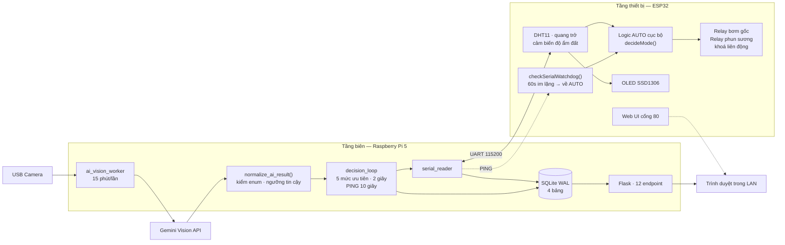

# Smart Home Garden

Hệ thống tưới cây tự động hai tầng cho khay rau ăn lá ngắn ngày. ESP32 đo cảm biến
và điều khiển bơm theo ngưỡng cục bộ; Raspberry Pi 5 chụp ảnh lá, gửi Gemini Vision
chẩn đoán, rồi đối chiếu kết quả đó với độ ẩm đất để quyết định can thiệp. Toàn bộ
trạng thái hiển thị trên dashboard web trong mạng LAN.

Đồ án Capstone, Samsung Innovation Campus — IoT Course.

## 1. Vấn đề và cách tiếp cận

Một bộ điều khiển tưới thông thường chỉ biết đúng một điều về khu vườn: đất ẩm bao
nhiêu phần trăm. Độ ẩm đất là đại lượng đại diện cho lượng nước trong giá thể, không
phải cho tình trạng của cây, và hai thứ này tách nhau ra đúng trong những trường hợp
làm chết cả khay rau:

- Cây héo rũ vì thiếu nước và cây héo rũ vì thối rễ có biểu hiện giống hệt nhau,
  nhưng cần hai hành động ngược nhau. Thối rễ xảy ra khi đất đang ẩm, nên bộ điều
  khiển theo ngưỡng đọc thấy độ ẩm bình thường và kết luận không có gì bất thường.
- Nấm đốm nâu lây qua nước đọng trên lá. Một chu kỳ phun sương giữa trưa nóng, khi
  cây đã nhiễm nấm, chính là thứ đẩy nhanh quá trình lây lan. Không cảm biến nào
  trong một hệ thông thường báo được điều này.
- Vàng lá đồng loạt ở lá già là dấu hiệu thiếu đạm. Hành động duy nhất mà bộ điều
  khiển theo độ ẩm có thể làm lại là tưới thêm nước.

Hệ thống này coi camera là cảm biến thứ hai, đầu ra không phải một con số mà là một
nhãn tình trạng cây. Câu hỏi đặt ra hẹp hơn phần lớn các nghiên cứu thị giác máy
trong nông nghiệp: không phải mô hình phân loại bệnh chính xác đến đâu, mà là những
quyết định điều khiển nào trở nên khả thi khi có đồng thời một nhãn thị giác và một
giá trị độ ẩm đất tại cùng một thời điểm.

## 2. Kiến trúc



Phân chia theo hướng biên là chủ ý: tầng đám mây đóng góp phán đoán chứ không cầm
quyền điều khiển, và tầng thiết bị giữ một chính sách dự phòng đầy đủ. Mất Internet
thì mất chức năng chẩn đoán, không mất chức năng tưới. Mất luôn Raspberry Pi thì
ESP32 vẫn tưới theo ngưỡng của chính nó.

## 3. Phần cứng

| Thành phần | Model | Chân |
|---|---|---|
| Vi điều khiển | ESP32 DevKit V1 | — |
| Nhiệt độ, ẩm không khí | DHT11 | GPIO 4 |
| Ánh sáng | Quang trở với trở kéo 10 kΩ | GPIO 34 (ADC1) |
| Độ ẩm đất | Cảm biến điện trở | GPIO 35 (ADC1) |
| Bơm tưới gốc | Module relay 5V, active LOW | GPIO 26 |
| Phun sương | Module relay 5V, active LOW | GPIO 27 |
| Màn hình | OLED SSD1306 128×64, I²C 0x3C | SDA 21, SCL 22 |
| Nút xoá cấu hình WiFi | Nút BOOT sẵn có | GPIO 0 |
| Máy tính trung tâm | Raspberry Pi 5 | — |
| Camera | Webcam USB 720p trở lên | /dev/video0 |

Cả hai kênh analog nằm trên ADC1 vì ADC2 không dùng được khi radio WiFi đang hoạt
động. GPIO 34 và 35 là chân chỉ vào, phù hợp cho cảm biến và giải phóng các chân
hai chiều cho relay và bus I²C. Relay active LOW nên mức chân trong lúc ESP32 khởi
động tương ứng với trạng thái nhả, không có nguy cơ bơm chạy khi cấp nguồn.

Ngưỡng trong [`firmware/v2/v2.ino`](firmware/v2/v2.ino):

```c
#define SOIL_DRY_PCT_THRESHOLD 40      // dưới 40% coi là đất khô
#define HOT_TEMP_THRESHOLD     33.0    // từ 33°C trở lên, nếu khô thì phun sương
#define DARK_LIGHT_THRESHOLD   20      // dưới 20% coi là tối
#define SERIAL_WATCHDOG_MS     60000   // 60s im lặng coi như Pi đã chết
```

`SOIL_DRY_PCT_THRESHOLD` phải khớp với `SOIL_DRY_THRESHOLD` trong `main.py`. Lệch
nhau thì hai tầng sẽ đánh giá "đất khô" khác nhau và tranh nhau điều khiển bơm.

Quang trở lấy trung bình 20 mẫu liên tiếp rồi làm mịn theo hàm mũ với trọng số 0.7
cho giá trị cũ và 0.3 cho giá trị mới. Không có bước này, bóng người đi qua cũng đủ
làm đảo trạng thái ngày/đêm. Độ ẩm đất được quy đổi sang phần trăm ngay trên thiết
bị để ngưỡng trong firmware và ngưỡng trong ma trận fusion cùng chỉ một đại lượng.

Firmware dùng WiFiManager, không nhúng SSID và mật khẩu vào mã nguồn. Lần đầu cấp
nguồn, ESP32 phát access point `SmartGarden-Setup` (mật khẩu `12345678`); giữ nút
BOOT khi cấp nguồn để xoá cấu hình cũ.

## 4. Giao thức serial

ESP32 gửi lên mỗi 2 giây, mỗi khung là một dòng JSON:

```json
{"temp":28.4,"humi":72,"soil":35,"light":48,"water":true,"mist":false,
 "mist_locked":false,"wd_tripped":false,"mode":"AUTO","reason":"Kho + binh thuong - tuoi goc"}
```

Trường `mode` chỉ nhận hai giá trị `AUTO` hoặc `MANUAL`. `LOCK_IDLE` được truyền về
dưới dạng `MANUAL` với cả hai relay đều nhả; mức quyết định thực sự do phía Pi báo
riêng. Trường `reason` là chuỗi lý do do firmware sinh ra, hiển thị nguyên văn trên
dashboard.

Pi gửi xuống các lệnh dạng văn bản, mỗi lệnh một dòng:

| Lệnh | Tác dụng |
|---|---|
| `WATER_ON`, `WATER_OFF` | Ép relay bơm gốc, chuyển ESP32 sang MANUAL |
| `MIST_ON`, `MIST_OFF` | Ép relay phun sương, chuyển sang MANUAL |
| `AUTO` | Bỏ mọi ràng buộc, trả quyền cho chính sách firmware |
| `LOCK_IDLE` | Nhả cả hai relay bất kể cảm biến, dùng cho khoá ban đêm và khoá thối rễ |
| `MIST_LOCK`, `MIST_UNLOCK` | Cấm hoặc cho phép phun sương mà **vẫn giữ AUTO** cho tưới gốc |
| `PING` | Nhịp tim 10 giây một lần, không đổi trạng thái |

Tách `MIST_LOCK` khỏi `MIST_OFF` là cần thiết. `MIST_OFF` là một trạng thái, và
logic AUTO sẽ bật lại relay ngay ở chu kỳ nóng kế tiếp. `MIST_LOCK` là một ràng
buộc, tồn tại cho tới khi được gỡ. Không có nó thì một chẩn đoán nấm chỉ có tác
dụng trong đúng một chu kỳ điều khiển.

## 5. Cây quyết định năm mức

`decision_loop()` đánh giá lại toàn bộ mỗi 2 giây. Dừng ở mức đầu tiên có điều kiện
đúng; không mức nào bị mức thấp hơn ghi đè.

| Mức | Tên | Điều kiện | Hành động |
|---|---|---|---|
| 1 | AI khẩn cấp | Chẩn đoán héo rũ, độ tin cậy từ 70 trở lên | Vào ma trận fusion: đất khô thì tưới xung 60 giây rồi cooldown 1 giờ; đất ẩm thì khoá 15 phút |
| 2 | Time Guard | 19:00 – 06:00 | `LOCK_IDLE`. Lệnh thủ công không ghi đè được mức này |
| 3 | Override thủ công | Lease do người dùng cấp còn hiệu lực | Giữ trạng thái đã ra lệnh cho hết 600 giây rồi tự trả `AUTO` |
| 4 | Ma trận fusion | Có chẩn đoán đáng tin, không thuộc mức khẩn cấp | Áp bảng ở mục 6 |
| 5 | Mặc định | Không mức nào ở trên đúng | `AUTO`, giao quyết định cho ngưỡng của ESP32 |

Đặt khoá ban đêm **trên** override thủ công là quyết định thiết kế, không phải sơ
suất. Tưới sau khi trời tối để lại nước đọng trên lá suốt đêm, đúng điều kiện nấm
cần, và người có khả năng tưới lúc 22 giờ nhất lại chính là chủ vườn vừa nhìn thấy
lá rũ xuống. Vì vậy khoá này không mang tính khuyến nghị.

Chính sách cục bộ trong firmware, chạy bất kể có Pi hay không, xét theo đúng thứ tự:

1. Tối và đất khô, trả `MODE_IDLE`. Tưới trong tối dễ gây úng.
2. Khô và nóng, phun sương. Nếu đang bị `MIST_LOCK` thì tưới gốc thay thế.
3. Khô và không nóng, tưới gốc.
4. Còn lại, nghỉ.

## 6. Ma trận fusion AI × độ ẩm đất

| Chẩn đoán | Đất khô (dưới 40%) | Đất đủ ẩm (từ 40%) | Đổi hành vi cơ cấu chấp hành? |
|---|---|---|---|
| Héo rũ, tin cậy từ 70 | Tưới xung 60 giây rồi trả `AUTO` | Khoá `LOCK_IDLE` 15 phút, nghi thối rễ | Có |
| Héo rũ, tin cậy dưới 70 | `AUTO` theo ngưỡng | `AUTO`, cảnh báo kiểm tra rễ bằng mắt | Không |
| Đốm nâu | `MIST_LOCK`, tưới gốc vẫn theo ngưỡng | `MIST_LOCK`, theo dõi nấm | Có |
| Vàng lá | `AUTO` theo ngưỡng | Cảnh báo thiếu đạm, không tưới thêm | Không, chỉ khuyến cáo |
| Bình thường | `AUTO` | `AUTO` | Không |
| Không xác định | `AUTO`, bỏ qua AI | `AUTO`, bỏ qua AI | Không |

Ba ô có đánh dấu "Có" là những ô không thể đạt được nếu chỉ có cảm biến độ ẩm. Ở
hàng đầu, một bộ điều khiển chỉ có đầu dò đất đọc thấy độ ẩm bình thường, kết luận
không có gì sai và không làm gì trong khi cây chết vì thối rễ. Ở hàng đốm nâu, đầu
dò đất không mang bất kỳ thông tin nào về nấm nên chu kỳ phun sương vẫn chạy và tiếp
tục phát tán bào tử. Hai hàng còn lại được ghi thẳng là khuyến cáo: hệ thống không
có bơm định lượng phân bón nên vàng lá chỉ được báo, không được xử lý.

### Kiểm chứng kết quả AI trước khi tin

`normalize_ai_result()` áp ba kiểm tra, kết quả không đạt bị hạ xuống
`khong_xac_dinh` và không có quyền tác động cơ cấu chấp hành:

```python
trusted = raw_state in VALID_AI_STATES and conf >= AI_MIN_CONF   # AI_MIN_CONF = 40
state   = raw_state if trusted else "khong_xac_dinh"
```

`VALID_AI_STATES` gồm bốn giá trị: `binh_thuong`, `vang_la`, `dom_nau`, `heo_ru`.
Mọi thứ khác, kể cả chuỗi `khong_xac_dinh` do chính mô hình trả về, đều bị hạ xuống
chứ không được ép về một chẩn đoán nào.

Lý do đặt lớp này giữa mô hình và bộ điều khiển: dạng hỏng của một mô hình thị giác
không phải là im lặng mà là nói sai một cách tự tin. Ở bản trước, hệ thống chấp nhận
kết quả `binh_thuong` với độ tin cậy bằng 0 và tiếp tục như thể cây đã được kiểm tra.

Việc kiểm tra khung ảnh có chứa cây hay không nằm ở lớp ngoài: prompt yêu cầu mô hình
tự khai báo, và `update_camera_health()` đếm số lần không đáng tin liên tiếp, phát
cảnh báo camera sau lần thứ ba.

## 7. Ba lớp an toàn

Hệ thống điều khiển bơm nước thật. Ba cơ chế độc lập bảo đảm bơm không chạy vô thời hạn.

**Bounded pulse.** Mọi lệnh ép cơ cấu chấp hành đều đi qua `pulse()` và đều có hạn.
Tưới khẩn cấp 60 giây rồi tự trả `AUTO`, sau đó cooldown 1 giờ. Khoá thối rễ 15 phút
rồi cooldown 30 phút. Không có đường nào để một actuator bị ép vô thời hạn.

**Watchdog serial.** Nếu Pi mất điện, treo hoặc bị dừng ngay sau khi gửi `WATER_ON`,
ESP32 sẽ kẹt trong chế độ thủ công với bơm đang chạy và không còn ai gửi lệnh tắt.
Firmware ghi lại thời điểm nhận dòng cuối cùng; quá 60 giây không nhận được gì và
chế độ thủ công hiện tại do Pi đặt ra, ESP32 nhả cả hai relay, quay về `AUTO` và bật
cờ `wd_tripped`. Chế độ thủ công người dùng bấm trên web UI của chính ESP32 không bị
đụng tới.

Vì `send_command()` lọc lệnh trùng, một quyết định giữ nguyên lâu không sinh byte nào
trên serial. `decision_loop` do đó gửi `PING` mỗi 10 giây để phân biệt "quyết định
đang ổn định" với "host đã chết". Thiếu nhịp này, watchdog sẽ huỷ đúng những trạng
thái cần giữ nhất, trong đó có khoá ban đêm.

**Time Guard.** Khung 19:00–06:00 luôn là `LOCK_IDLE`, đặt trên mức override thủ
công. Firmware còn một lớp thứ hai độc lập với đồng hồ của Pi: tối và đất khô thì nghỉ.

## 8. Cài đặt

### 8.1 Nạp firmware

Arduino IDE, cài board package ESP32 và các thư viện `WiFiManager`,
`Adafruit GFX Library`, `Adafruit SSD1306`, `DHT sensor library`. Mở
[`firmware/v2/v2.ino`](firmware/v2/v2.ino), chọn board *ESP32 Dev Module*, Upload.

Nếu Pi đang chạy service thì nó đang giữ cổng serial, phải dừng trước khi nạp:
`sudo systemctl stop smart-garden`. Chi tiết ở [`firmware/README.md`](firmware/README.md).

### 8.2 Cài trên Raspberry Pi 5

Yêu cầu Raspberry Pi OS Bookworm 64-bit (`uname -m` phải ra `aarch64`), nguồn 27W
USB-C, thẻ nhớ từ 32 GB class A2.

```bash
git clone https://github.com/dtc245010034-rgb/Home-Garden-An-IoT-AI-System-for-Automated-Plant-Care-last.git ~/smart_garden
cd ~/smart_garden
bash deploy/install.sh
```

Script làm tám bước: cài gói hệ thống, cấp quyền `dialout` và `video`, tạo tên cổng
cố định `/dev/esp32` bằng udev, tạo virtualenv, cài thư viện, hỏi `GEMINI_API_KEY`,
cài systemd service, khởi động. Xong thì `sudo reboot` một lần để quyền nhóm có hiệu
lực. API key lấy miễn phí tại <https://aistudio.google.com/apikey>.

Toàn bộ hướng dẫn triển khai, xác minh phần cứng và xử lý sự cố nằm ở
[`SETUP_PI5.md`](SETUP_PI5.md).

### 8.3 Đặt camera

Đây là bước quyết định chất lượng dữ liệu AI, và là thứ phần mềm không sửa được.

| Yếu tố | Yêu cầu |
|---|---|
| Khoảng cách | 25–40 cm từ ống kính tới tán lá |
| Góc | Chếch 45° từ trên xuống. Không chụp thẳng đứng, bóng thân camera sẽ đổ lên lá |
| Khung hình | Lá chiếm từ 60% diện tích. Không để bàn, tường, mặt người lọt vào |
| Ánh sáng | Tránh ngược sáng cửa sổ. Chụp ban đêm cần đèn LED trắng khoảng 5000K |
| Nền | Bìa trắng hoặc đen phía sau khay rau |
| Cố định | Dùng giá đỡ. Camera xê dịch làm mất giá trị toàn bộ chuỗi thời gian |

Kiểm tra bằng cách mở dashboard, bấm "Chụp và chẩn đoán ngay", rồi xem nhãn dưới
vòng tròn sức khoẻ phải là "ĐỦ TIN CẬY ĐỂ RA QUYẾT ĐỊNH".

## 9. Dashboard

`http://<IP_CUA_PI>:5000`, mở được từ mọi máy trong cùng LAN, thiết kế ưu tiên màn
hình điện thoại.

| Khu vực | Nội dung |
|---|---|
| Vòng tròn sức khoẻ | Chẩn đoán đã kiểm chứng, kèm nhãn nêu rõ kết quả có được phép tác động cơ cấu chấp hành hay không, và nút chẩn đoán ngay với cooldown 60 giây |
| Bốn thẻ cảm biến | Nhiệt độ, ẩm không khí, độ ẩm đất, ánh sáng. Thẻ độ ẩm đất có thêm nhãn khô hoặc đủ ẩm so với mốc 40% |
| Biểu đồ diễn biến | Chọn 1 giờ, 6 giờ, 24 giờ hoặc 7 ngày. Từ 60 phút trở xuống lấy từ RAM; dài hơn thì truy vấn SQLite và lấy mẫu thưa còn tối đa 300 điểm |
| Kho ảnh lá | Ảnh mới nhất và dải 20 ảnh thu nhỏ, mỗi ảnh gắn độ tin cậy và ghi chú của AI |
| Thiết bị và quyết định | Trạng thái bơm, sương, chế độ firmware, mức quyết định đang áp dụng, và lý do của cả hai tầng |
| Ma trận fusion | Bảng ở mục 6, tự tô sáng ô đang khớp với chẩn đoán hiện tại |
| Điều khiển thủ công | Sáu lệnh, kèm đồng hồ đếm ngược phần còn lại của lease 600 giây |
| Nhật ký hệ thống | 25 sự kiện gần nhất và nút xuất CSV 24 giờ |

Bốn băng cảnh báo hiện tự động khi cần: camera không nhận diện được cây, tưới khẩn
cấp hoặc khoá thối rễ kèm thời gian còn lại, phun sương đang bị khoá, và watchdog
thiết bị đã kích hoạt.

Trang tự làm mới với nhịp khác nhau tuỳ loại dữ liệu: trạng thái 3 giây, lịch sử 20
giây, nhật ký 30 giây, thống kê 60 giây. Biểu đồ được vẽ bằng cách sinh thẳng đường
dẫn SVG trong trang, không nạp thư viện biểu đồ nào. Lý do thực dụng: trang được
phục vụ từ một máy tính nhúng tới trình duyệt điện thoại trên mạng có thể không có
đường ra Internet, nên một trang phụ thuộc CDN sẽ trắng đúng vào lúc hệ thống được
thiết kế để vẫn hoạt động.

## 10. REST API

| Endpoint | Method | Mô tả |
|---|---|---|
| `/` | GET | Trang dashboard |
| `/api/status` | GET | Toàn bộ trạng thái: cảm biến, AI, mức quyết định, các đồng hồ đếm ngược |
| `/api/history?minutes=60` | GET | Lịch sử cảm biến, `minutes` từ 5 đến 10080 |
| `/api/image` | GET | Ảnh lá mới nhất, JPEG, `no-store` |
| `/api/photos` | GET | 50 ảnh gần nhất kèm metadata chẩn đoán |
| `/api/photo/<name>` | GET | Một ảnh cụ thể, tên phải khớp `leaf_\d{8}_\d{6}\.jpg` |
| `/api/events?limit=60` | GET | Nhật ký sự kiện, `limit` từ 1 đến 500 |
| `/api/diagnosis?limit=30` | GET | Lịch sử chẩn đoán AI |
| `/api/stats` | GET | Số liệu tổng hợp cho phần Testing của báo cáo |
| `/api/health` | GET | Kiểm tra sức khoẻ 5 mục: serial, AI, camera, CSDL, số lỗi 1 giờ qua. Trả 503 khi có mục hỏng |
| `/api/export.csv?hours=24` | GET | Xuất CSV, `hours` từ 1 đến 720 |
| `/api/command` | POST | `{"cmd":"WATER_ON"}`, mở lease thủ công 600 giây |
| `/api/check_leaf` | POST | Chụp và chẩn đoán ngay. Trả 429 nếu còn cooldown 60 giây |

```bash
curl -s http://192.168.1.50:5000/api/status | jq '.sensor, .ai.trang_thai, .decision_level'
curl -X POST -H 'Content-Type: application/json' \
     -d '{"cmd":"WATER_ON"}' http://192.168.1.50:5000/api/command
```

## 11. Cơ sở dữ liệu

SQLite chế độ WAL (`smart_garden.db`). Chọn WAL vì tiến trình Flask đọc trong khi
vòng lặp quyết định đang ghi; chế độ này cho phép đọc song song mà không chặn ghi,
và cơ sở dữ liệu vẫn phục hồi được sau mất điện đột ngột. Khi khởi động,
`db_restore_history()` nạp lại 60 phút gần nhất để biểu đồ không trống.

| Bảng | Nhịp ghi | Cột |
|---|---|---|
| `sensor_readings` | 60 giây | `ts, epoch, temp, humi, soil, light, water, mist, mode` |
| `ai_diagnosis` | Mỗi lần chẩn đoán | `ts, epoch, source, trang_thai, raw_state, do_tin_cay, trusted, ghi_chu, photo, soil` |
| `commands` | Mỗi lệnh gửi xuống ESP32 | `ts, epoch, cmd, level, reason` |
| `events` | Mỗi sự kiện đáng chú ý | `ts, epoch, event, detail` |

Kho ảnh `photos/leaf_YYYYmmdd_HHMMSS.jpg` tự giữ 50 file mới nhất.
`smart_garden_events.log` giữ định dạng JSON-lines để tương thích ngược.

Truy vấn mẫu cho báo cáo nằm ở [`SETUP_PI5.md`](SETUP_PI5.md) mục 7.

## 12. Cấu trúc mã nguồn

```
.
├── main.py                            
├── templates/dashboard.html           
├── firmware/
│   ├── README.md                      Hướng dẫn nạp
│   └── v2/v2.ino                      433 dòng, firmware v2.1
├── deploy/
│   ├── install.sh                     Script cài tự động
│   └── smart-garden.service           Unit systemd, Restart=always
├── tests/                             45 bài pytest, không cần phần cứng
├── requirements.txt
├── KIEM-THU.md                        Cách kiểm thử, kịch bản diễn, lỗi ghi ở đâu
├── SETUP_PI5.md
└── README.md
```

Tên file `.ino` trùng tên thư mục chứa nó vì Arduino IDE bắt buộc như vậy mới mở
được sketch.

`main.py` chạy bốn luồng phụ bên cạnh vòng lặp quyết định ở luồng chính:

| Luồng | Chu kỳ | Việc |
|---|---|---|
| `serial_reader` | Liên tục | Đọc JSON từ ESP32, cập nhật state, ghi SQLite mỗi 60 giây |
| `ai_vision_worker` | 15 phút | Chụp ảnh, gọi Gemini, chuẩn hoá, ghi DB, cập nhật sức khoẻ camera |
| `dashboard_worker` | — | Flask server |
| `input_listener` | — | Nhận lệnh bàn phím, chỉ khi `stdin.isatty()` |
| `decision_loop` | 2 giây | Luồng chính: `PING` và cây năm mức ưu tiên |

Trạng thái dùng chung gói gọn trong vài đối tượng có khoá bảo vệ, và mọi lệnh tới
cơ cấu chấp hành đều rời tiến trình qua đúng một hàm, nên bảng `commands` đầy đủ
theo cấu trúc chứ không nhờ kỷ luật lập trình.

## 13. Biến môi trường

| Biến | Mặc định | Ý nghĩa |
|---|---|---|
| `GEMINI_API_KEY` | bắt buộc | Không có thì chương trình thoát ngay với thông báo rõ ràng |
| `SG_SERIAL_PORT` | `/dev/ttyUSB0` | Nên đặt `/dev/esp32`, tên cố định do udev rule tạo |
| `SG_CAM_INDEX` | `0` | Pi 5 liệt kê nhiều `/dev/videoN` cho cùng một webcam |
| `SG_PORT` | `5000` | Cổng dashboard |
| `SG_MODEL` | `gemini-3.1-flash-lite` | Model Gemini Vision. Nếu API báo model không tồn tại thì đổi sang model đang khả dụng trong tài khoản |

Trên Pi các biến này nằm trong `/etc/smart-garden.env` với quyền 600. API key không
bao giờ nằm trong repo; `.gitignore` đã loại trừ `*.env`, `smart_garden.db`,
`photos/` và `venv/`.

## 14. Hạn chế đã biết

| # | Hạn chế | Hậu quả | Hướng khắc phục |
|---|---|---|---|
| 1 | `/api/command` không có xác thực | Bất kỳ thiết bị nào trong LAN đều bật được bơm | Token cho các endpoint đổi trạng thái, để mở phần chỉ đọc |
| 2 | Dùng Flask development server | Không chịu được tải cao | Đủ cho vài người xem trong LAN; production nên dùng gunicorn hoặc waitress |
| 3 | Chẩn đoán phụ thuộc Internet | Mất mạng là mất tầng AI | Hệ thống vẫn tưới theo cảm biến. Có thể đánh giá một mô hình phân loại nhỏ chạy tại chỗ |
| 4 | DHT11 sai số ±2°C và ±5% RH | Ngưỡng phun sương 33.0°C rất thô, độ ẩm không dùng để điều khiển được | Thay bằng DHT22 hoặc SHT31 |
| 5 | Cảm biến độ ẩm đất loại điện trở | Điện cực ăn mòn sau vài tuần ngâm liên tục | Thay bằng loại điện dung. Phần mềm không cần sửa vì giá trị đã chuẩn hoá trên thiết bị |
| 6 | Ngưỡng đất khô khai báo ở hai nơi | Sửa một chỗ mà quên chỗ kia gây tranh chấp điều khiển | Xem cảnh báo ở mục 3 |
| 7 | Firmware ESP32 chưa có test tự động | Watchdog và `decideMode()` chỉ kiểm bằng tay | Bộ test hiện chỉ phủ phía Raspberry Pi. Xem [`KIEM-THU.md`](KIEM-THU.md) mục 6 |
| 8 | Chưa đo độ chính xác mô hình trên tập có nhãn | Ngưỡng 40 và 70 là suy luận, chưa phải hiệu chỉnh | Gán nhãn một tập ảnh và hiệu chỉnh lại hai ngưỡng theo tỷ lệ lỗi |
| 9 | Một camera cho một khay | Không mở rộng được cho nhiều khay | Hỗ trợ nhiều nguồn ảnh với trạng thái riêng từng khay |

## 15. Lịch sử phiên bản

### v2.2

Bốn khiếm khuyết tìm được khi đọc firmware và `main.py` đối chiếu với nhau thay vì
đọc riêng từng bên, cộng bốn lỗi hiển thị trên dashboard.

| Khiếm khuyết | Hậu quả | Cách sửa |
|---|---|---|
| `main.py` không gửi heartbeat mà watchdog firmware chờ | Do lệnh trùng bị lọc, `LOCK_IDLE` ban đêm chỉ được gửi một lần. Sau 60 giây watchdog hiểu nhầm Pi đã chết và nhả khoá, có thể tưới trong tối — đúng thứ Time Guard sinh ra để ngăn. Khoá thối rễ và override tay bị vô hiệu cùng cách | `PING` mỗi 10 giây trong `decision_loop` |
| Khung sự kiện của ESP32 bị đọc như khung cảm biến | `latest_sensor` bị ghi đè, dashboard mất số liệu và fusion mất đầu vào độ ẩm đất đúng lúc đang báo lỗi | Khung không có trường `temp` được đưa sang nhật ký sự kiện |
| Thuộc tính `hidden` vô tác dụng với mọi phần tử có khai báo `display` | Bốn băng cảnh báo, lưới biểu đồ rỗng và khung ảnh hiện thường trực, trong đó một băng không có chữ nào. Nguyên nhân: khai báo của tác giả thắng stylesheet mặc định của trình duyệt | `[hidden]{display:none!important}` |
| Ghi chú AI chèn vào trang không escape; dấu thời gian thumbnail lệch một ký tự | Một dấu `<` trong ghi chú làm hỏng cả danh sách nhật ký; `14:30` hiện thành `_1:43` | Escape khi chèn, sửa offset |
| Cờ `wd_tripped` từ firmware bị bỏ qua | Watchdog kích hoạt mà không ai biết | Thêm băng cảnh báo |
| Google Fonts tải chặn render | Pi trong LAN không Internet làm dashboard trắng trang tới khi DNS timeout | `media="print" onload="this.media='all'"` |
| Sparkline bị `preserveAspectRatio="none"` kéo giãn | Nét vẽ dày mỏng không đều | `vector-effect="non-scaling-stroke"` |
| Hai file `.ino` nằm chung một thư mục | Arduino IDE biên dịch cả hai và báo lỗi trùng hàm | Chuyển sang `firmware/v2/v2.ino` đúng chuẩn sketch |


### v2.1

Watchdog serial trên ESP32: tự quay về `AUTO` nếu mất liên lạc với Pi quá 60 giây,
thay vì kẹt với bơm đang chạy cho tới khi hết nước.

### v2.0

| # | Vấn đề ở v1 | Cách sửa |
|---|---|---|
| 1 | Camera chĩa sai chỗ nhưng hệ thống im lặng báo bình thường | Prompt có bước kiểm tra ảnh có cây, đếm chuỗi thất bại, băng cảnh báo, sự kiện `camera_alert` |
| 2 | Chấp nhận `binh_thuong` với độ tin cậy 0 và trạng thái ngoài enum | `normalize_ai_result()` kiểm enum và ngưỡng 40; kết quả không đạt không được tác động actuator |
| 3 | Bơm có thể bật vô thời hạn suốt cửa sổ cooldown một giờ | Cơ chế `pulse()`: tưới khẩn cấp 60 giây rồi tự trả `AUTO` |
| 4 | Lịch sử cảm biến chỉ trong RAM, mất khi restart | SQLite WAL ghi mỗi 60 giây, nạp lại 60 phút gần nhất khi khởi động |
| 5 | Event log không có số liệu cảm biến | Bốn bảng và endpoint xuất CSV |
| 6 | Ảnh bị ghi đè, không truy vết được chẩn đoán về khung ảnh sinh ra nó | Tên file có dấu thời gian, giữ 50 file, dải thumbnail trên dashboard |
| 7 | AI chỉ tác động một trong bốn trạng thái, còn lại chỉ ghi log | Ma trận fusion với ba ô đổi hành vi thật |
| 8 | Chạy tay, log cho thấy sáu lần khởi động rải rác | systemd `Restart=always`, `RestartSec=10` |
| 9 | Tên cổng đổi giữa `ttyUSB0` và `ttyUSB1` | udev rule tạo tên cố định `/dev/esp32` |

## Giấy phép

MIT, xem [LICENSE](LICENSE).

Trường Đại học Công nghệ Thông tin và Truyền thông (ICTU) — Samsung Innovation
Campus, IoT Capstone Project.
