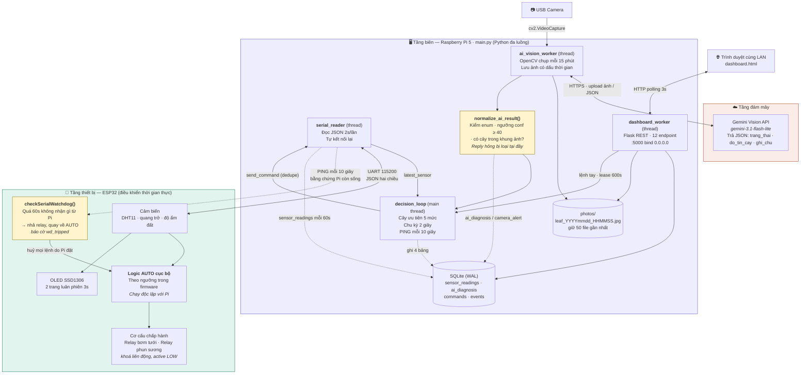
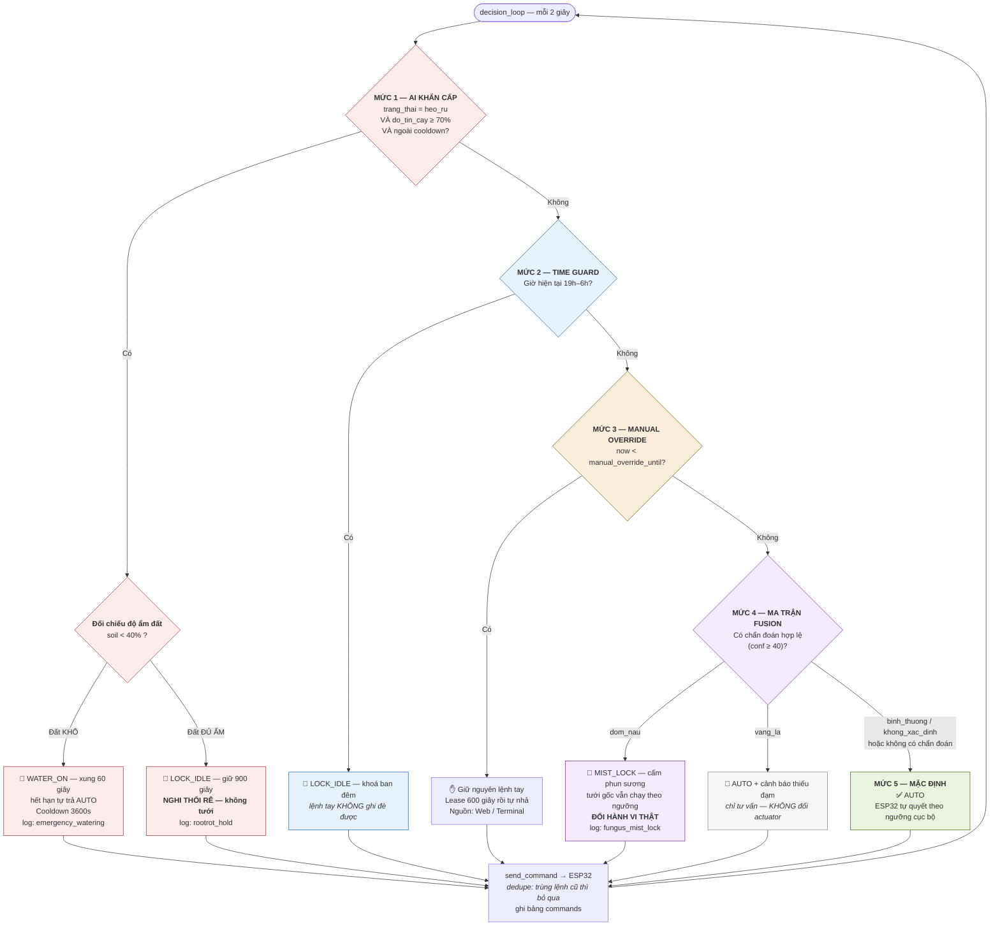
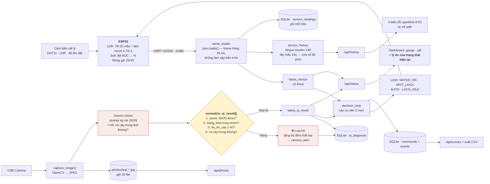
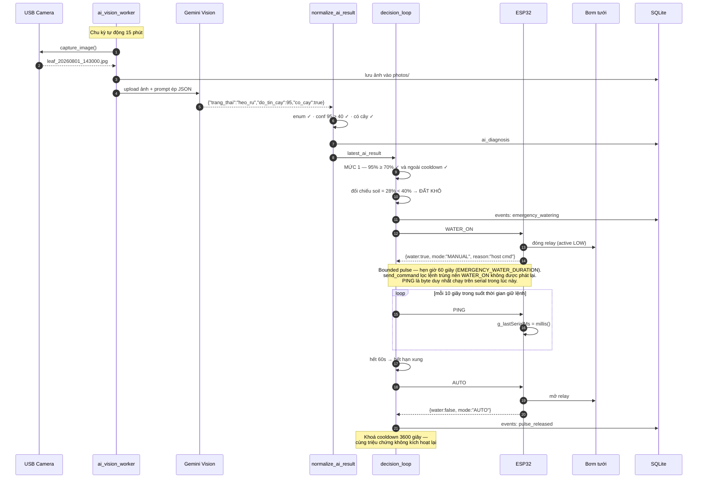
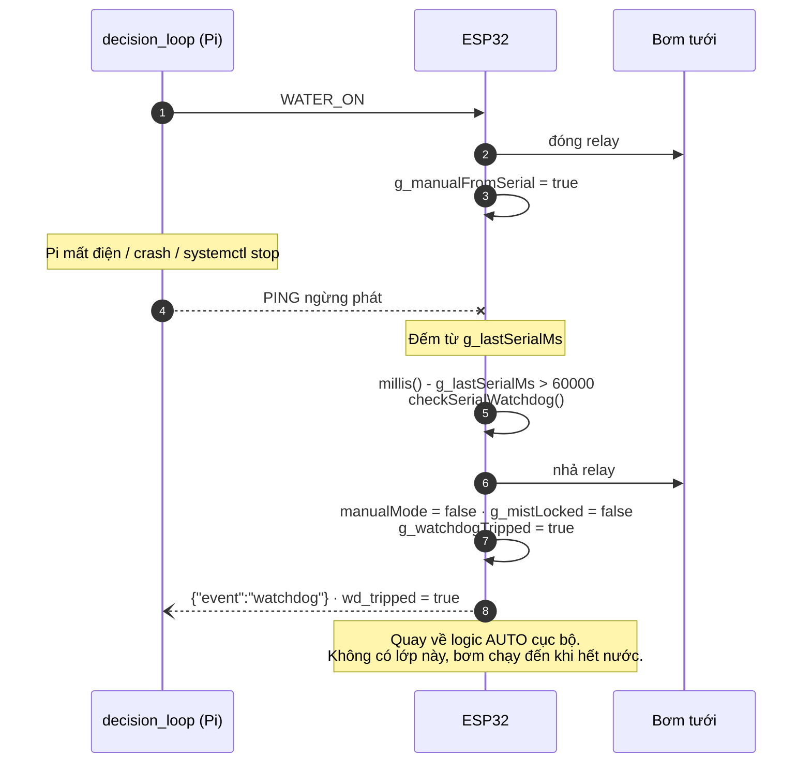
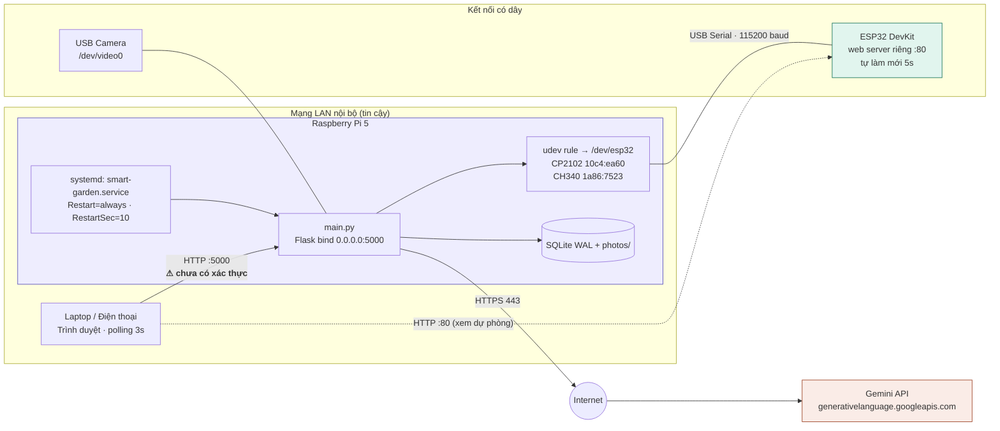
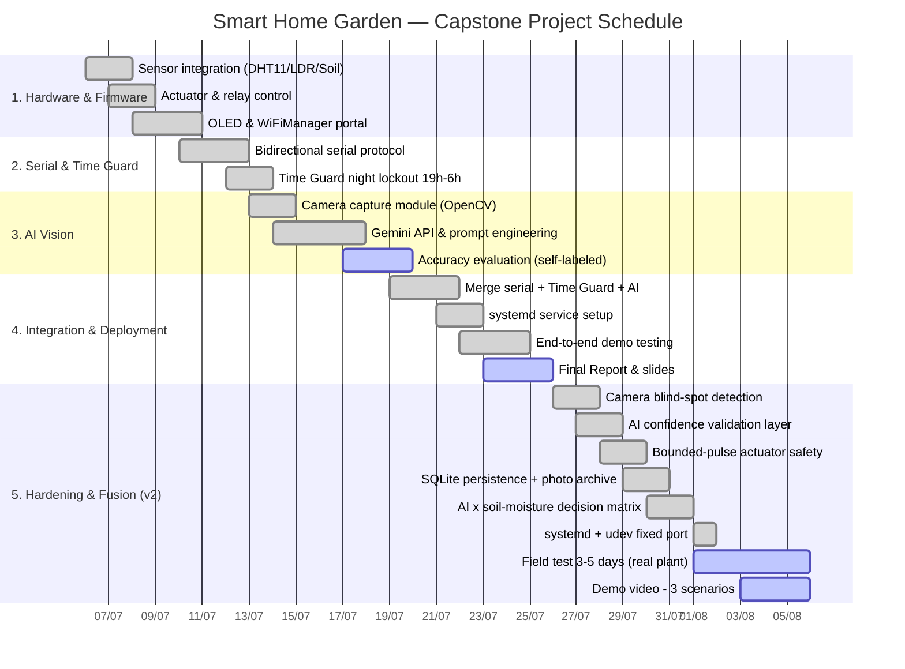
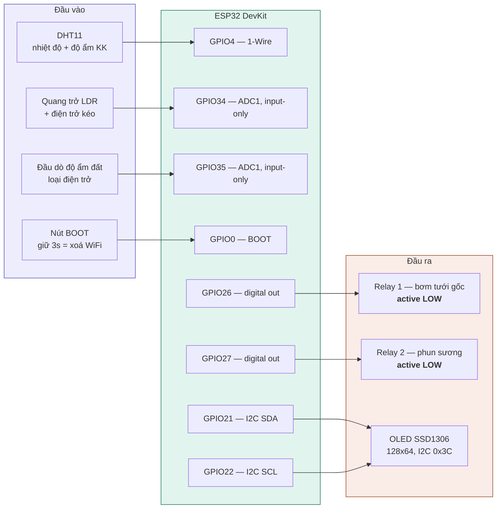

# Bộ sơ đồ hệ thống — Smart Home Garden (SIC IoT Capstone) — **BẢN v2**

> **Thay cho `smart_garden_diagrams.md` cũ.** Bản cũ mô tả logic v1 và mâu thuẫn với Final Report ở 3 chỗ:
> mức 1 không rẽ theo độ ẩm đất, mức 4 ghi "không ép actuator" (sai với `dom_nau`), và sequence còn ghi
> bounded-pulse là "đề xuất" trong khi nó đã được cài đặt. Bản này đã sửa cả ba.
>
> **PNG đã xuất sẵn ở [`hinh/`](hinh/)**, scale 3x, nền trắng, dán thẳng vào `.docx`
> được. Chỉ cần xuất lại khi sửa mã nguồn sơ đồ (xem mục cuối tài liệu).

## File PNG và vị trí trong báo cáo

| File trong `hinh/` | Mục Final Report | Caption |
|---|---|---|
| `01-kien-truc-tong-quan.png` | 2.1 | Figure 2.1 — System architecture overview |
| `02-cay-quyet-dinh-5-muc.png` | 2.3 | Figure 2.3 — Five-level priority decision tree |
| `03-luong-xu-ly-du-lieu.png` | 2.2 | Figure 2.2 — Data processing flow |
| `04a-sequence-tuoi-khan-cap.png` | 3.5 | Figure 3.5 — Emergency watering sequence with bounded pulse |
| `04b-sequence-watchdog.png` | 2.3 hoặc 3.5 | Figure — Serial watchdog releasing a forced actuator |
| `05-so-do-trien-khai.png` | 3.2 | Figure 3.2 — Deployment and network topology |
| `06-gantt-wbs.png` | 1.4 | Figure 1.1 — Project schedule |
| `07-so-do-chan-cam.png` | 3.3 | Figure 3.3 — ESP32 pin assignment |

Sơ đồ 2 nên đặt riêng một trang khổ ngang. Sơ đồ 7 rất rộng (tỷ lệ khoảng 4.8:1),
đặt ngang hoặc thu theo chiều rộng trang.

| Sơ đồ | Đưa vào mục Final Report | Đổi so với bản cũ |
|---|---|---|
| 1. Kiến trúc tổng quan | 2.1 IoT Service Model | Thêm lớp validate, SQLite 4 bảng, kho ảnh, cảnh báo camera, **watchdog serial + PING** |
| 2. Cây quyết định 5 mức | 2.3 Service Implementation | **Sửa nặng** — mức 1 rẽ theo độ ẩm đất, mức 4 là ma trận fusion |
| 3. Luồng xử lý dữ liệu | 2.2 Data Processing | Thêm `normalize_ai_result()`, SQLite thay cho file log |
| 4. Sequence tưới khẩn cấp | 3.5 Testing and Improvements | **Sửa** — bounded pulse là hiện trạng; thêm nhịp PING và **nhánh hỏng khi Pi chết** |
| 5. Sơ đồ triển khai | 3.2 Network and Communication | Thêm systemd, udev, cổng cố định |
| 6. Gantt WBS | 1.4 Schedule and Milestones | Thêm Phase 5 (26/07–05/08) |
| 7. Sơ đồ chân cắm | 3.3 Hardware Implementation | **Mới** — dùng tạm nếu chưa kịp vẽ Fritzing |

---

## 1. Kiến trúc tổng quan hệ thống
**→ Mục 2.1 · Caption: *Figure 2.1 — System architecture overview.***



> Hai nút nền vàng là hai lớp chặn độc lập: `normalize_ai_result()` chặn kết quả AI
> không đáng tin đi vào quyết định, `checkSerialWatchdog()` chặn cơ cấu chấp hành
> kẹt ở trạng thái ép khi Pi chết. Vì `send_command()` lọc lệnh trùng, một quyết
> định giữ nguyên lâu không sinh byte nào trên serial, nên `PING` là thứ duy nhất
> phân biệt "quyết định đang ổn định" với "host đã chết".

---

## 2. Cây quyết định 5 mức ưu tiên — **ĐÃ SỬA**
**→ Mục 2.3 · Caption: *Figure 2.3 — Five-level priority decision tree, re-evaluated every two seconds.***
> Nên xuất riêng một trang A4. Đây là hình ăn điểm nhất của cả báo cáo.



**Ghi chú đặt dưới hình trong báo cáo:** `MIST_UNLOCK` được phát khi chẩn đoán `dom_nau` không còn xuất
hiện trong chu kỳ kế tiếp. Mọi lệnh ép actuator đều có thời hạn, nên hệ luôn tự quay về `AUTO`.

---

## 3. Luồng xử lý dữ liệu (Data Processing) — **ĐÃ SỬA**
**→ Mục 2.2 · Caption: *Figure 2.2 — Data processing flow from physical sensors to dashboard.***



---

## 4. Sequence — kịch bản tưới khẩn cấp — **ĐÃ SỬA**
**→ Mục 3.5 · Caption: *Figure 3.5 — Emergency watering sequence with bounded pulse.***



Nhánh hỏng — Pi mất điện hoặc treo ngay sau khi phát `WATER_ON`:



---

## 5. Sơ đồ triển khai (Deployment)
**→ Mục 3.2 · Caption: *Figure 3.2 — Deployment and network topology.***



---

## 6. Gantt — WBS cho báo cáo
**→ Mục 1.4 · Caption: *Figure 1.1 — Project schedule (Gantt view of the Work Breakdown Structure).***
> Đã đồng bộ với file WBS Excel (có Phase 5). Sửa `done`/`active` cho khớp thực tế trước khi nộp.



---

## 7. Sơ đồ chân cắm — **MỚI**
**→ Mục 3.3 · Caption: *Figure 3.3 — ESP32 pin assignment.***
> Đây là bản **dùng tạm**. Nếu kịp thời gian, hãy vẽ lại bằng **Fritzing** (có sẵn ESP32, module relay,
> DHT11) hoặc **draw.io** thư viện Electrical — sơ đồ có hình linh kiện thật sẽ ăn điểm hơn ở tiêu chí
> *Proper tool usage*.



**Hai chú thích kỹ thuật nên viết kèm hình** (giám khảo hay hỏi):
1. Hai kênh analog dùng **GPIO34 và GPIO35 thuộc ADC1** vì ADC2 bị vô hiệu khi WiFi đang bật — đây là
   ràng buộc phần cứng của ESP32, không phải lựa chọn ngẫu nhiên.
2. Module relay **active LOW**: mức HIGH khi khởi động là trạng thái *nhả*, nên bơm không bị đóng nhầm
   trong lúc ESP32 đang boot.

---

## Xuất lại PNG sau khi sửa sơ đồ

Các file trong `hinh/` được dựng bằng Chrome headless, không cần cài mermaid-cli.
Script đo kích thước SVG trước rồi chụp đúng khung ở `--force-device-scale-factor=3`,
nên ảnh không thừa lề và không bị cắt:

```bash
python doc/mkpng.py doc/smart_garden_diagrams_v2.md /tmp/render doc/hinh
```

Sửa mã sơ đồ xong thì chạy lại lệnh trên, mọi PNG được ghi đè.

Hai lỗi đã gặp khi dựng, ghi lại để khỏi mất công lần sau:

- Dấu chấm phẩy trong `Note` của `sequenceDiagram` bị hiểu là dấu kết thúc câu lệnh
  và làm hỏng cả khối. Dùng dấu chấm thay thế.
- Hai cạnh cùng đổ vào một nút sẽ bị dagre đặt nhãn chồng lên nhau. Bỏ nhãn của một
  trong hai cạnh, rút ngắn chữ không giải quyết được.

## Ghi chú khi xuất ảnh dán vào .docx

1. **mermaid.live** → tab *Actions* → PNG, đổi `scale` thành **3**. Mặc định 1x sẽ mờ khi in A4.
2. Nếu Word làm vỡ ảnh: xuất **SVG** rồi Insert → Picture — Word giữ nguyên vector, phóng to không mờ.
3. Sơ đồ 2 nên để **riêng một trang ngang** nếu chữ bị nhỏ.
4. Caption chuẩn học thuật đặt **dưới** hình, in nghiêng, đánh số theo mục: *Figure 2.3 — ...*
5. Trong Final Report đã có sẵn 8 khung nét đứt đúng vị trí — chỉ cần thay khung bằng ảnh.
